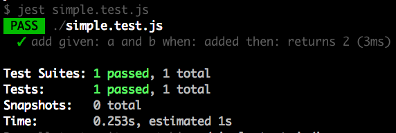
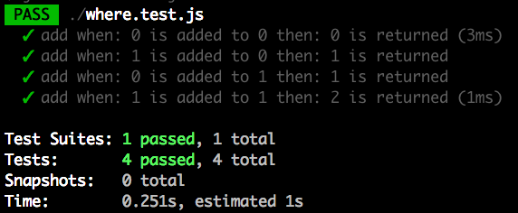

<div align="center">
<h1>babel-plugin-gwt</h1>

Data Driven Testing babel plugin inspired by Groovy's <a href="http://spockframework.org/">Spock</a> framework

🖖
</div>

<hr />

[](https://travis-ci.org/mattphillips/babel-plugin-gwt)
[](https://codecov.io/github/mattphillips/babel-plugin-gwt)
[](https://www.npmjs.com/package/babel-plugin-gwt)
[](http://npm-stat.com/charts.html?package=babel-plugin-gwt&from=2017-09-14)
[](https://github.com/mattphillips/babel-plugin-gwt/blob/master/LICENSE)
[](http://makeapullrequest.com)
[](https://github.com/mattphillips/babel-plugin-gwt/blob/master/docs/ROADMAP.md)
[](https://github.com/mattphillips/babel-plugin-gwt/blob/master/docs/EXAMPLES.md)

 - ❤️ Data Tables
 - 🛀 Clean tests
 - 🎉 Multiple tests written once
 - 💪 Optional given, when, then API

## Problem

Writing clean descriptive tests can sometimes be difficult and cumbersome.

## Solution

This plugin provides syntactic sugar to make writing well documented data driven tests easy and enjoyable.

[Data Driven Testing](https://en.wikipedia.org/wiki/Data-driven_testing) is when we test the same behavior
multiple times with different parameters and assertions, `babel-plugin-gwt's` data driven testing support makes this a
first class feature.

`babel-plugin-gwt` gives your standard Javascript tests four new blocks `given`, `when`, `then`, `where` (you can
continue to use whichever test runner and assertion library that you like with this plugin).

 - `given`, `when`, `then` blocks are used to generate your test title making it easier to write, read and maintain
 your test.

 - Data Tables are supported with the `where` block used to write test data for your test to be ran multiple times with
  different inputs.

## Installation

With npm:
```sh
npm install --save-dev babel-plugin-gwt
```

With yarn:
```sh
yarn add -D babel-plugin-gwt
```

## Setup

### .babelrc

```json
{
  "plugins": ["babel-plugin-gwt"]
}
```

### CLI

```sh
babel --plugins babel-plugin-gwt script.js
```

### Node

```javascript
require('babel-core').transform('code', {
  plugins: ['babel-plugin-gwt'],
})
```

## Usage

### Basic

A simple test with `babel-plugin-gwt` could look something like:

```js
it('add', () => {
  given: 'a and b'
  const a = 1;
  const b = 1;

  when: 'added'
  const actual = a + b;

  then: 'returns 2'
  expect(actual).toBe(2);
});
```
`↓ ↓ ↓ ↓ ↓ ↓`



### With Data Table

This test can become more powerful by using the `where` block to run the same test multiple times with different data.
The where block allows you to define variables that are available anywhere in the test and to use the `$` symbol in your
test title and `given`, `when`, `then` blocks to interpolate values into the generated test title.

```js
it('add', () => {
  when: '$a is added to $b'
  const actual = a + b;

  then: '$expected is returned'
  expect(actual).toBe(expected);

  where: {
    a | b || expected
    0 | 0 || 0
    1 | 0 || 1
    0 | 1 || 1
    1 | 1 || 2
  }
});
```
`↓ ↓ ↓ ↓ ↓ ↓`



### API

All label blocks are optional, and some like `given` may not make sense for every test.

#### `given`

The `given` block is used to describe the inputs of your test.

 - Arguments: `String`

Example: `given: 'some input'`

#### `when`

The `when` block is used to describe the behaviour being tested.

 - Arguments: `String`

Example: `when: 'something happens'`

#### `then`

The `then` block is used to describe the assertions being made.

 - Arguments: `String`

Example: `then: 'it should be ...'`

#### `where`

The `where` block is used to supply your test with a data table. The table must have the following structure:
 - The first row must be variable names you wish to use within the test. These will be hoisted into the whole
  scope of the test block and so can be used anywhere inside of the test.
 - All other rows can be data and variables available in the outer scope that you may be testing
 - Columns of data are separated with `|`, a convention is to use two pipes (`||`) for any expected values (although
 this is just a convention under the hood both `|` and `||` are treated the same).

Example:
```js
  where: {
    a | b || expected
    0 | 0 || 0
    1 | 0 || 1
    0 | 1 || 1
    1 | 1 || 2
  }
```

#### interpolation

All description blocks (`given`, `when`, and `then`) and the usual test description can add values to be interpolated
with the `$` symbol infront of the variable name defined in the `where` block table.

## Supported testing frameworks

`babel-plugin-gwt` supports all of the following test blocks: `it`, `fit`, `xit`, `it.only`, `it.skip`, `test`,
`ftest`, `xtest`, `test.only`, `test.skip`.

That means that the following frameworks are supported:

 - [Jest](https://facebook.github.io/jest/)
 - [Ava](https://github.com/avajs/ava#usage)
 - [Moca](https://mochajs.org/)
 - [Tape](https://github.com/substack/tape)
 - [Cypress](https://www.cypress.io/)
 - Other? Send PR to add 🙌

## ⚠️ Linting

Some of the syntaxes used within this plugin will more than likely upset most linters so it is probably advisable to
disable them within the tests using `babel-plugin-gwt`.

For example eslint:

```js
it('add', () => {
  /* eslint-disable no-undef, no-unused-labels */
  when: '$a is added to $b'
  const actual = a + b;

  then: '$expected is returned'
  expect(actual).toBe(expected);

  where: {
    a | b || expected
    0 | 0 || 0
    1 | 0 || 1
    0 | 1 || 1
    1 | 1 || 2
  }
});
```

## ❌ Object/Array literal broken syntax

Within the where block the first column does not support `Object`(`{}`) or `Array` (`[]`) literals

Not supported:
```js
where: {
  obj  | key   | value || expected
  {}   | 'foo' | 'bar' || { foo: 'bar' }
}
```

Supported:
```js
where: {
  key  | obj | value || expected
  'foo'| {}  | 'bar' || { foo: 'bar' }
}
```

## Other solutions

 - [jest-each](https://www.github.com/mattphillips/jest-each)
 - [mocha-each](https://www.npmjs.com/package/mocha-each)

## Contributors

<!-- ALL-CONTRIBUTORS-LIST:START - Do not remove or modify this section -->
<!-- prettier-ignore -->
| [<br /><sub><b>Matt Phillips</b></sub>](http://mattphillips.io)<br />[💻](https://github.com/mattphillips/babel-plugin-gwt/commits?author=mattphillips "Code") [📖](https://github.com/mattphillips/babel-plugin-gwt/commits?author=mattphillips "Documentation") [💡](#example-mattphillips "Examples") [🤔](#ideas-mattphillips "Ideas, Planning, & Feedback") [⚠️](https://github.com/mattphillips/babel-plugin-gwt/commits?author=mattphillips "Tests") |
| :---: |
<!-- ALL-CONTRIBUTORS-LIST:END -->

## LICENSE

[MIT](/LICENSE)
